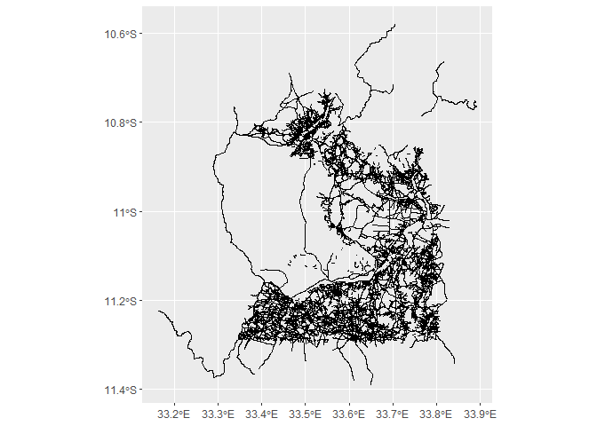
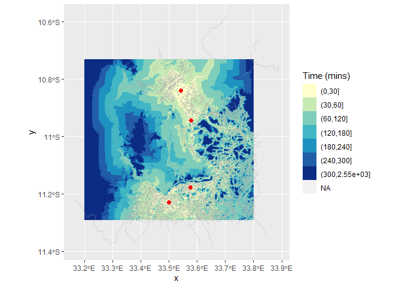

### NDVI data generation using rgee


```r
## load required packages, and install packages which are potentially missing on client computers
list.of.packages <- c("sf", "mapview", "googledrive", "osmdata", "ggplot2", "raster", "gdistance", "fasterize", "remotes", "rgdal")
new.packages <- list.of.packages[!(list.of.packages %in% installed.packages()[,"Package"])]
if(length(new.packages)) install.packages(new.packages)
lapply(list.of.packages, library, character.only = TRUE)

## install rgee from github
remotes::install_github("r-spatial/rgee")
library(rgee)
```

This first bit is all about connecting to GEE via the rgee package. You should only need to run this next part once. 

```r
ee_install()
```

Once completed it should say 'Well done! rgee was successfully set up in your system.' and will then prompt you to restart your system. It also suggests running ee_check however there may currently be an issue with this function so I suggest you don't run it.
Then, initialise GEE. This will check whether you have everything set up to use GEE via R. If you don't additional steps will be described.

We then initialise the rgee package. 

Note that you need to link to a Google account that has been given GEE access to be able to complete this stage. As we'll also be using Google Drive for downloading and uploading data, we also need to include 'drive=TRUE'. 


```r
ee_Initialize(email = 'shell.stanton82@gmail.com', drive = TRUE)
```

I think you also only need to run this once, but I'm not 100% sure.

Now we can use R to run code on Google Earth Engine. Note that lots of examples of translating GEE syntax to be used in rgee can be found here url{https://csaybar.github.io/rgee-examples/}.

First, define the area of interest:


```r
bbxmin <- 33.2
bbxmax <- 33.8
bbymin <- -11.29
bbymax <- -10.73
```


```r
aoi <- ee$Geometry$Polygon(coords=list(c(bbxmin, -bbymax), c(bbxmax, bbymax), c(bbxmax, bbymin), c(bbxmin, -bbymin)))
```

Read in the Landsat 8 Tier 1 dataset

```r
ls8 <- ee$ImageCollection("LANDSAT/LC08/C01/T1_RT_TOA")
```

Filter the LS8 collection by area & then by collection date


```r
spatialFiltered <- ls8$filterBounds(aoi)
temporalFiltered <- spatialFiltered$filterDate('2018-06-01', '2018-09-30')
```

Create a cloud mask, apply the mask and calculate NDVI for the unmasked pixels

```r
ndvilowcloud <- function(image) {
  # Get a cloud score in [0, 100].
  cloud <- ee$Algorithms$Landsat$simpleCloudScore(image)$select('cloud')

  # Create a mask of cloudy pixels from an arbitrary threshold (20%).
  mask <- cloud$lte(20)

  # Compute NDVI using inbuilt function
  ndvi <- image$normalizedDifference(c('B5', 'B4'))$rename('NDVI')

  # Return the masked image with an NDVI band.
  image$addBands(ndvi)$updateMask(mask)
}

cloudlessNDVI = temporalFiltered$map(ndvilowcloud)
```

Calculate the median NDVI per pixel and clip to the area of interest

```r
medianimage <- cloudlessNDVI$median()$select('NDVI')
medNDVIaoi <- medianimage$clip(aoi)
```

View output

```r
Map$centerObject(aoi)
#Map$addLayer(medNDVIaoi)

Map$addLayer(
  eeObject=medNDVIaoi,
  visParam=list(min=-1, max=1, palette=c('blue', 'white', 'green')),
  name="Median NDVI"
)
```

These data are all stored as an image within GEE. We can convert this image to a raster and download it using Google drive (drive) or Google Cloud Storage (gcs). More information on this can be obtained here url{https://r-spatial.github.io/rgee/reference/ee_as_raster.html} 


```r
med_ndvi <- ee_as_raster(
  image = medNDVIaoi,
  region = aoi,
  scale = 30,
  via = 'drive'
)
```

### OpenStreetMap data


We can directly download OSM road data for our aoi. The bounding box is in the format c(xmin, ymin, xmax, ymax)


```r
aoi_bbox = c(bbxmin, bbymin, bbxmax, bbymax)
q <- opq(bbox = aoi_bbox) %>%
    add_osm_feature(key = 'highway') %>%
    osmdata_sf()

ggplot(q$osm_lines)+geom_sf()
```

<!-- -->

### Assign speeds
We now want to assign speeds to the NDVI pixels plus the roads

#### NDVI pixels by walking speed


```r
# Temporarily read in NDVI from folder, downloaded from GEE
ndvipath <- "./data/NDVIexample.tif"
ndvi <- raster(ndvipath)

# Reclassify so that <0.35 = impassable, 0.35-0.6 = 3.5km/h, 0.6-0.7 = 2.48km/h and > 0.7 = 1.49km/h 
ndviwalk_kph <- c(0.1, 3.5,  2.48, 1.49)
# Convert to m/s
ndviwalk_mps <- ndviwalk_kph/3.6
# Convert to crossing time in seconds, assuming travel along hypotenuse and pixel size is 30m
ndviwalk_secs <- 42.43/ndviwalk_mps
  
# Convert km/h to m/s
ndviwalk_vec <- c(-1, 0.35, ndviwalk_secs[1], 0.35, 0.6, ndviwalk_secs[2], 0.6, 0.7, ndviwalk_secs[3], 0.7, 1, ndviwalk_secs[4])
ndviwalk_mat <- matrix(ndviwalk_vec, ncol = 3, byrow = TRUE)
ndvi_assigned <- ndvi
ndvi_assigned <- reclassify(ndvi_assigned, ndviwalk_mat)
```

#### Roads by motor vehicle


```r
# Primary = 80kph, secondary = 80kph, 'Other' road speed = 20 kph
road_vector <- c("primary", "secondary", "motorway", "trunk")
q$osm_lines$motorspeedkph <- ifelse(q$osm_lines$highway %in% road_vector, 80, 20)
q$osm_lines$motorspeedmps <- q$osm_lines$motorspeedkph/3.6
# Assume a 30m resolution cell
q$osm_lines$time_secs <- 42.43/q$osm_lines$motorspeedmps

# Convert to raster, matching up with the NDVI raster resolution and extent
# Note that the fasterize function only works with polygons, so adding a buffer to the roads of ~30m
roads.poly <- st_buffer(q$osm_line, 0.00015)
```

```
## dist is assumed to be in decimal degrees (arc_degrees).
```

```r
osm_road_raster <- fasterize(roads.poly, ndvi_assigned, "time_secs", fun = 'min')
```

#### Merge NDVI and road rasters together


```r
## merge the NDVI and the OSM, retain the minimum value (this is the quickest cell crossing time)
friction_surface_motor <- mosaic(osm_road_raster, ndvi_assigned, fun = min, tolerance = 1)


writeRaster(friction_surface_motor,
            "./outputs/friction_raster_motor",
            format = "GTiff", overwrite=TRUE)
```

### Calculate shortest paths

First, add in health facility locations. Currently I'm reading in the facilities around Vwaza that have rHAT diagnostics, but will edit this to use afrimapr.


```r
healthfac <- st_read("./data/healthfacexample.shp")
```

```
## Reading layer `healthfacexample' from data source `C:\Users\Joshua.Longbottom\Dropbox\PhD\Collaboration projects\accessibility_comparison\accessibility\data\healthfacexample.shp' using driver `ESRI Shapefile'
## Simple feature collection with 4 features and 21 fields
## geometry type:  POINT
## dimension:      XY
## bbox:           xmin: 33.49996 ymin: -11.22941 xmax: 33.57893 ymax: -10.83907
## geographic CRS: WGS 84
```


```r
# First calculate the transition matrix
# Check the transitionFunction
trans_motor <- transition(friction_surface_motor, transitionFunction = function(x){1/mean(x)}, directions=8)

# Then calculate the cumulative cost
leastcost_motor <-  accCost(trans_motor, as_Spatial(healthfac))

writeRaster(leastcost_motor,
            "./outputs/leastcost_raster_motor",
            format = "GTiff", overwrite=TRUE)
```
Now create some plots of the data.


```r
## warning for removing NA pixels is masked
lcm_df <- as.data.frame(leastcost_motor, xy = TRUE)
lcm_df$mins <- lcm_df$layer/60

ggplot()+geom_raster(data=lcm_df, aes(x = x, y = y, fill = cut(mins, c(0,30,60,120,180,240,300,max(mins)))))+
    scale_fill_brewer(palette = "YlGnBu")+
    geom_sf(data=q$osm_lines, colour="darkgrey", alpha=0.3)+
    geom_sf(data=healthfac, size=2, colour="red")+
    guides(fill=guide_legend(title="Time (mins)"))
```

<!-- -->
